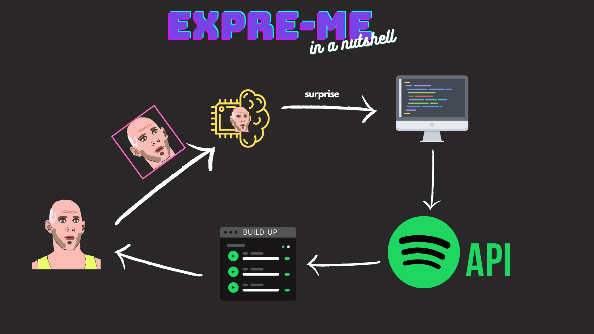
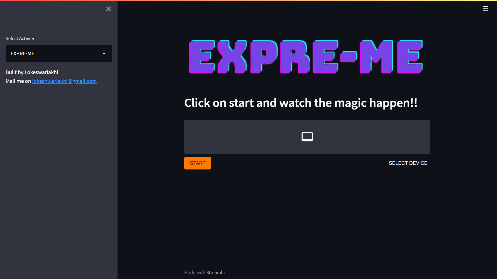
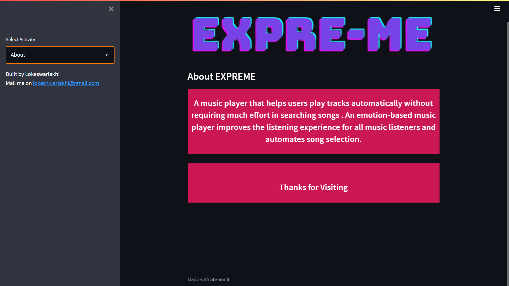
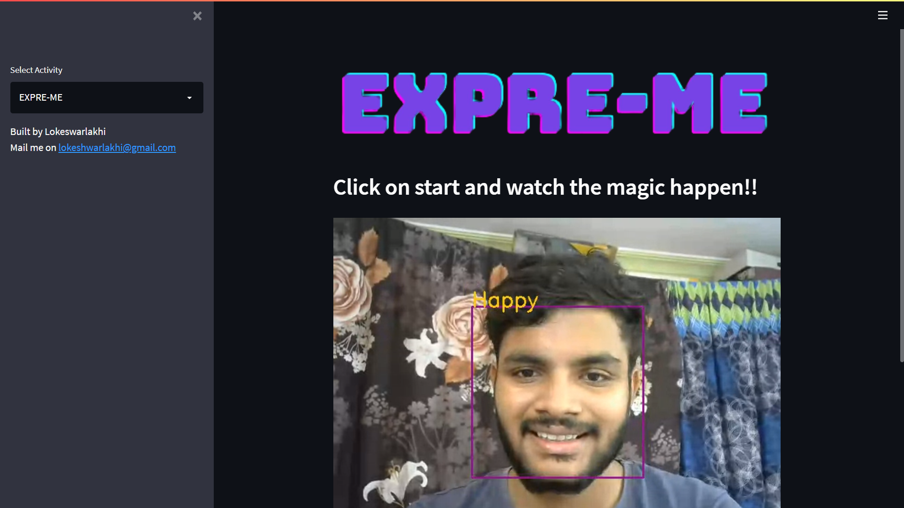

# Table of contents
- [Introduction](#intro)
- [How is EXPREME built?](#tech)
    - [Tech stack used](#techstack)   
- [How does Expreme model works?](#workflow)
- [Expreme UI](#ui)
- [Contributing](#contribute)
---
# Introduction <a id = intro></a>
Nowadays, the availability of digital music is very abundant compared to the previous era, so to sort out all this digital music is very time consuming and causes information fatigue.e. Therefore, it is very useful to develop a music recommender system that can search music libraries automatically and suggest songs that are suitable for users.
> **EXPREME** is developed based on the idea of providing appropriate music to the user without using much effort in searching and choosing the best song to play, **EXPREME** does that for you.

*EXPREME* is a music player that helps users play tracks automatically without requiring much effort in searching songs. An emotion-based music player improves the listening experience for all music listeners and automates song selection.

---
# How is EXPREME built? <a id = tech></a>
Expreme is basically a deep learning model which predicts the users face expression and categorized the emotion they are trying to project in one of the 7 basic emotions which are:
1) Angry
2) Disgust
3) Fear
4) Happy
5) Neutral
6) Sad
7) Surprise

So to train the model I have used the [FER2013](./dataset.rar) dataset which consists of over 30000 records of all the 7 types of expressions.

## Tech stack Used <a id = techstack></a>
to deal with the dataset as it was in the form of csv file, I've used `numpy` and `pandas`.
and used `keras` and `Tensorflow` libraries to train test split , build the CNN(convolutional neural network), and to train the model. 

---
# How does Expreme model works? <a id = workflow> </a>
To give a better understanding consider the below image. 

So , as given in the above image. the first step starts from reading the user's facial expressiona and drawing the cascade to extract the optimal features and then the frame is deliverd to the DL model.
after the expression gets predicted the predicted result is further given to our algorithm in the form of string.
Now here comes the interesting part , in the algorithm, when the expression string is recieved, each expression is mapped to list of search strings where it radomly takes a serch string, and gathers the list of playlists based on the search string.
after getting the playlist's information the code will randomly choose a playlist from the gathered playlist list and now it will collect the track details from the playlist through API and plays a random song based from that playlist. and now for the next song this whole process repeats again.
it something looks like this, see the below psuedo code:
``` P
while(true){
    1) choose a seach string
    2) gather top 5 playlist's info from Spotify API
    3) choose 1 random playlist
    4) gather track's info from Spotify API
    5) choose 1 random song 
}
```
This extreme randomness of playing the songs will lead to:
- Alsomt negligible probability of playing the same song.
- The user gets to explore new songs every time.
- There is a scope of getting the new artists into the limelight.

---
# Expreme UI <a id = ui></a>





---
# Contributing <a id = contribute ></a>
Got any ideas that you want to contribute to this repository? Sure, you are open to contribute. 
fork,clone,commit,send the PR. 

---
Make sure you star the repo if you gain any value through this. :-)
#### Hail Data 🖖🏾.